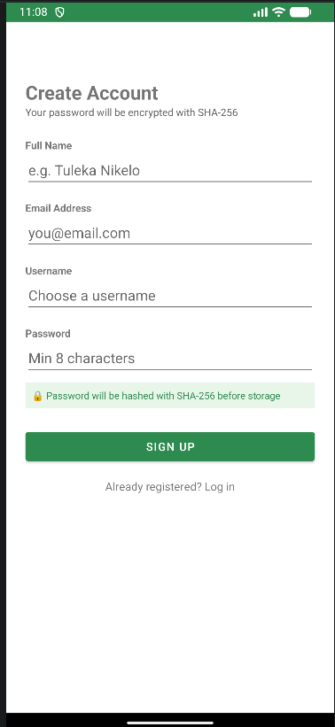
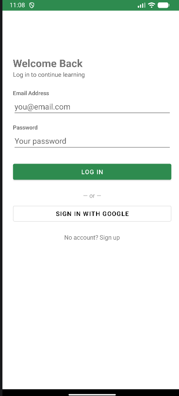
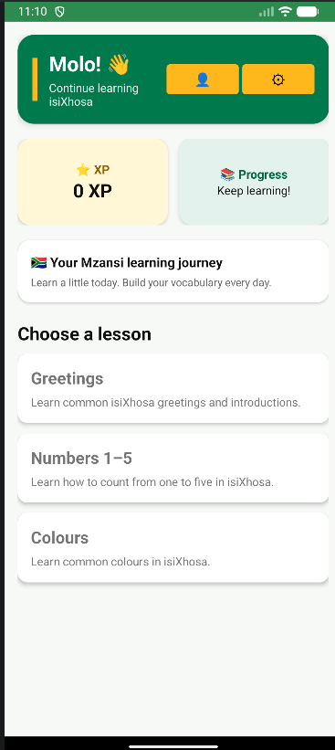
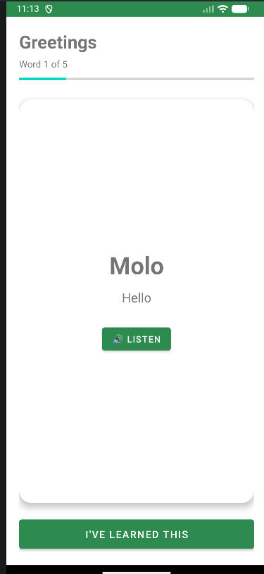
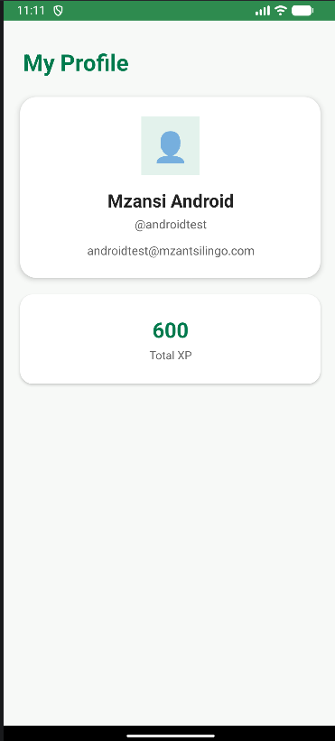
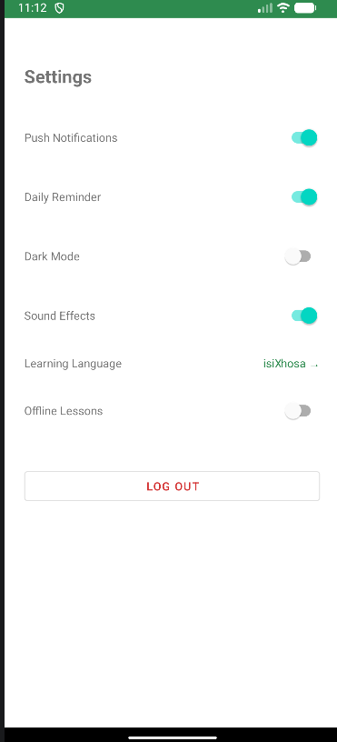

# MzansiLingo

MzansiLingo is an Android language learning application designed to help beginners learn South African languages through simple lessons, vocabulary, interactive activities and progress tracking. The application is currently focused on helping users learn isiXhosa in a simple and engaging way. Users can create an account, log in securely, select their learning language, access lessons, learn new words, listen to pronunciation and earn XP as they complete lessons. The project was developed as part of the OPSC6312 Portfolio of Evidence and demonstrates the use of Android development, REST APIs, database integration, user authentication and version control.

## Project Purpose

The purpose of MzansiLingo is to provide a beginner friendly platform for learning isiXhosa through an interactive mobile application. The application aims to make language learning easier by combining structured lessons, vocabulary practice, audio pronunciation(this will be added at a later stage) and progress tracking in one place.

## Features

MzansiLingo currently includes the following features:

- User registration and login
- Secure password handling through the backend
- Onboarding screens for new users
- Learning language selection
- Home screen with available lessons
- Lessons retrieved from the REST API
- Vocabulary learning with isiXhosa words and English meanings
- Lesson completion tracking
- XP rewards for completing lessons
- User profile displaying account information and total XP
- Application settings
- Learning language selection in settings
- Dark mode
- Notification and daily reminder settings
- Sound effects settings
- User logout

## Technologies Used

### Android Application

- Kotlin
- Android Studio
- Android SDK
- XML layouts
- RecyclerView
- Retrofit
- OkHttp
- Gson
### Backend

- C#
- ASP.NET Core Web API
- Entity Framework Core
- Pomelo Entity Framework Core MySQL provider

### Database

- MySQL
- phpMyAdmin

### Development Tools

- Visual Studio
- Android Studio
- Git
- GitHub
- XAMPP

## System Architecture

MzansiLingo uses a client server architecture.

The Android application acts as the client and communicates with the ASP.NET Core Web API using HTTP requests. The API handles application logic, authentication and communication with the MySQL database.

The main components are:

1. Android Application: Provides the user interface and handles user interaction.
2. REST API: Handles requests from the Android application and processes application data.
3. MySQL Database: Stores user and lesson information.
4. Entity Framework Core: Connects the ASP.NET Core API to the MySQL database.

The general flow of the application is:

Android App - REST API - MySQL Database

Responses are then returned from the database through the API to the Android application.
## REST API

MzansiLingo uses an ASP.NET Core Web API to connect the Android application to the backend database.

The Android app uses Retrofit to send requests to the API. The API then processes the request and gets or updates the required information in the MySQL database.

### Authentication

| Method | Endpoint | What it does |
|---|---|---|
| POST | `/api/auth/register` | Registers a new user |
| POST | `/api/auth/login` | Logs an existing user in |

### Lessons

| Method | Endpoint | What it does |
|---|---|---|
| GET | `/api/lessons?language=isiXhosa` | Gets the available isiXhosa lessons |
| GET | `/api/lessons/{id}` | Gets a specific lesson |

### Learning Content

| Method | Endpoint | What it does |
|---|---|---|
| GET | `/api/lessons/{lessonId}/words` | Gets the words for a lesson |
| GET | `/api/lessons/{lessonId}/quiz` | Gets quiz questions for a lesson |

### User Information

| Method | Endpoint | What it does |
|---|---|---|
| GET | `/api/users/{userId}` | Gets the user's profile |
| GET | `/api/users/{userId}/xp` | Gets the user's XP |
| POST | `/api/users/{userId}/xp` | Adds XP to the user's account |
| GET | `/api/users/{userId}/achievements` | Gets the user's achievements |
| PUT | `/api/users/{userId}/settings` | Updates the user's settings |

The API returns data to the Android application in JSON format.

## Database

MzansiLingo uses MySQL to store the application's data.

The ASP.NET Core API connects to the MySQL database using Entity Framework Core. This allows the application to save and retrieve information without the Android app connecting directly to the database.

The database currently contains information for users and lessons.

The `Users` table stores details such as:

- Full name
- Email
- Username
- Password hash

The `Lessons` table stores:

- Lesson title
- Lesson description
- Learning language

MySQL and phpMyAdmin were used during development to create and manage the database.

## Authentication and Security
When a user creates an account, their password is sent to the backend and hashed before it is stored in the database. The application uses ASP.NET Core's `PasswordHasher` to handle the password hashing. When the user logs in, the password they enter is checked against the stored password hash instead of being stored as plain text. The registration process also checks whether the email address or username is already being used.

## GitHub and Version Control

GitHub was used to store the MzansiLingo source code and keep track of changes made during development.
The team used Git branches so that members could work on different parts of the application without directly changing the main branch.

Some of the work that was managed using Git included:

- Android application development
- User authentication
- Lesson functionality
- Profile and settings screens
- REST API development
- Database integration
- Bug fixes and improvements
The project repository contains both the Android application and the backend API.

## Installation and Setup
To run MzansiLingo, the following software is required:
- Android Studio
- Android SDK
- JDK
- Visual Studio
- .NET SDK
- MySQL
- XAMPP
- Git

### Android Application

1. Clone the MzansiLingo repository from GitHub.
2. Open the project in Android Studio.
3. Allow Android Studio to download and sync the required Gradle dependencies.
4. Make sure an Android emulator or physical Android device is connected.
5. Run the application from Android Studio.

### Backend API

1. Open the `MzansiLingo.API` project in Visual Studio.
2. Make sure MySQL is running.
3. Create the `MzansiLingoDb` database.
4. Check the database connection string in `appsettings.json`.
5. Build and run the ASP.NET Core API.
6. Make sure the Android application is using the correct API address.

## How to Run the Application
### Start the Database
1. Open XAMPP.
2. Start MySQL.
3. Make sure the `MzansiLingoDb` database is available.

### Start the API
1. Open the `MzansiLingo.API` project in Visual Studio.
2. Run the ASP.NET Core Web API.

### Start the Android App
1. Open the MzansiLingo project in Android Studio.
2. Start an Android Emulator or connect an Android device.
3. Run the application.
4. Create an account or log in with an existing account.
5. Select a learning language.
6. Open the available lessons from the Home screen.

## Testing
The following areas were tested:

- User registration
- User login
- Incorrect login details
- Password validation
- Language selection
- Loading lessons from the REST API
- Loading lesson vocabulary
- Completing a lesson
- Adding XP
- Viewing the user profile
- Updating application settings
- Dark mode
- Logging out
- API and database communication
Testing was performed using the Android Emulator

## Screenshots
### Onboarding

 
 

### Register

### Login

### Home

### Lessons

### Profile

### Settings

## Team Members
MzansiLingo was developed as a team project by:
Indiphile Jobela: Android application development, backend/API development, database integration and project documentation
Tuleka Nikelo: Application development, testing and project contributions
Zintle Hazel Roman: N/A

## AI Usage
AI was mainly used to:

- Help explain programming concepts and errors.
- Assist with debugging and troubleshooting.
- Provide suggestions for improving code structure.
- Help with understanding Kotlin, Android development, C#, ASP.NET Core and SQL and how to merge them together.
- Assisted with project documentation as far as professional wording and laying out the strructure of the ReadMe.

The team reviewed and tested the suggestions provided by AI before using them in the project. The final implementation, testing and integration of the application were carried out by the team.

## Project Repository

The complete MzansiLingo source code is available on GitHub.
https://github.com/MzansiLingo/MzansiLingoApp.git
The repository contains the Android application, backend API and project documentation.